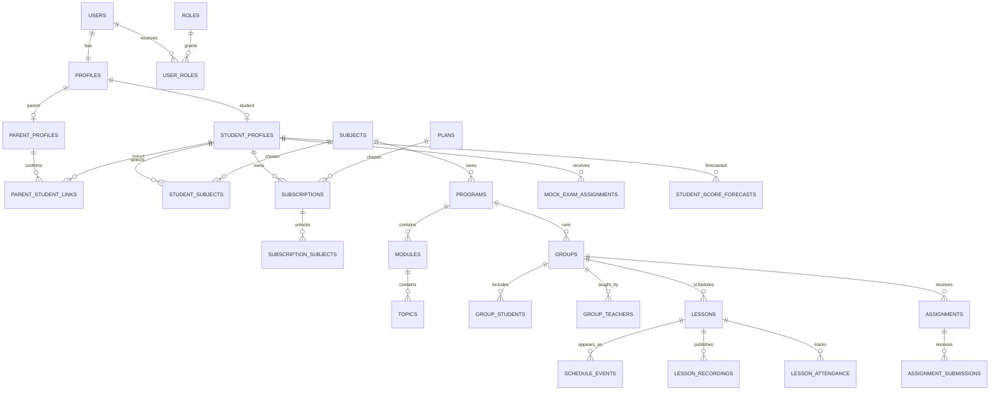
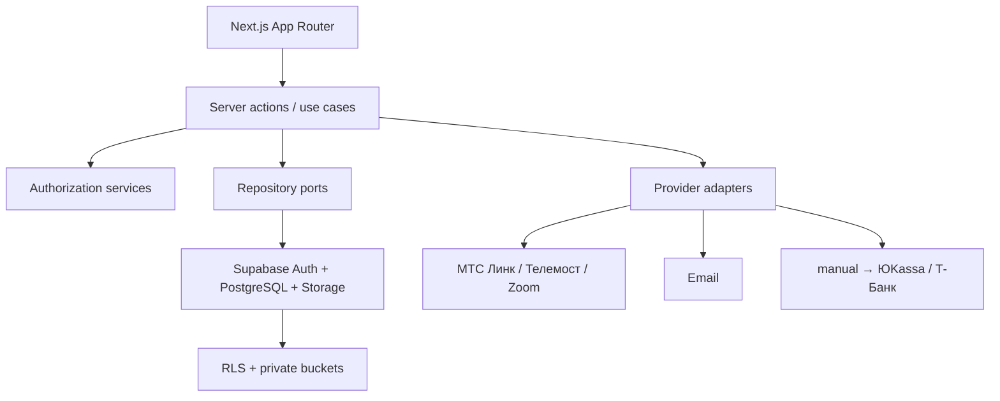

# «Пятёрка»: архитектура MVP

Версия 0.3 · 1 августа 2026

> Детализированная целевая модель после аудита Open edX, Canvas и Moodle находится в [TARGET_LMS_ARCHITECTURE.md](TARGET_LMS_ARCHITECTURE.md). Этот документ сохраняется как исходный контракт MVP.

## 1. Краткое описание продукта

«Пятёрка» — ролевая платформа подготовки к ЕГЭ/ОГЭ: живые занятия во внешнем видеосервисе, записи и материалы, ДЗ, тренажёры, два пробника в месяц, объяснимая аналитика, куратор и отдельный родительский контроль. Доступ определяется не только ролью, а активной подпиской, купленным предметом и членством в группе.

## 2. Карта ролей и прав

| Объект | Ученик | Родитель | Преподаватель | Куратор | Администратор |
|---|---|---|---|---|---|
| Профиль ученика | свой RU | подтверждённые дети R | свои группы R | закреплённые R | CRUD |
| Уроки/расписание | свои группы R | дети R | свои группы CRUD | закреплённые R | CRUD |
| Посещаемость | своя R | дети R | свои уроки CU | закреплённые R | CRUD |
| ДЗ/пробники | свои попытки CR | результаты детей R | назначение/проверка | контроль R | CRUD |
| Переписка | свои беседы | отдельные беседы | свои беседы | назначенные беседы | аудит |
| Тарифы/роли/оплаты | свои R | детей R | — | — | CRUD |

Родитель не наследует доступ к сообщениям ребёнка. Admin назначается только серверной операцией с аудитом.

## 3. Карта пользовательских сценариев

- Гость: лендинг → предметы/тариф → диагностика → регистрация.
- Ученик: регистрация → 8 шагов онбординга → пакет → профиль/предметы/цели/подписка/план → расписание → подключение → запись → ДЗ → два пробника → прогресс → куратор.
- Родитель: одноразовое приглашение → свой аккаунт → подтверждение связи → выбор ребёнка → прогресс/посещаемость/ДЗ/пробники/отчёты/оплаты → настройка частоты отчётов.
- Преподаватель: назначенные группы → урок и ссылка встречи → посещаемость → запись/материалы → ДЗ → ручная проверка → аналитика группы.
- Куратор: очередь риска → карточка закреплённого ученика → индивидуальная задача/сообщение → отчёт → публикация выбранной аудитории.
- Администратор: справочники → тарифы → группы → назначения → ручная подписка → контент → аудит/webhooks.

## 4. Sitemap

```text
/
├─ /login /register /check-email /onboarding
├─ /student
│  ├─ schedule subjects videos homework trainers mock-exams progress admission messages profile subscription
├─ /parent
│  ├─ children progress attendance homework mock-exams reports schedule messages payments settings
├─ /teacher
│  ├─ groups lessons assignments reviews question-bank analytics
├─ /curator
│  ├─ students risks tasks reports messages
└─ /admin
   ├─ users roles subjects programs plans groups lessons mock-exams payments content audit settings integrations
```

## 5. ER-диаграмма



## 6. Таблицы и ключевые поля

Все изменяемые таблицы: UUID PK, `created_at`, `updated_at`; soft delete у профилей/контента. Результаты, оплаты и аудит физически не удаляются обычной админской операцией.

- Доступ: `profiles`, `roles`, `user_roles`, `student_profiles`, `parent_profiles`, `teacher_profiles`, `curator_profiles`, `parent_student_links`, `invitations`, `notification_preferences`.
- Академия: `exam_types`, `subjects`, `programs`, `modules`, `topics`, `subtopics`, `groups`, `group_students`, `group_teachers`, `curator_students`, `academic_periods`.
- Онбординг: `student_onboarding`, `student_subjects`, `student_goals`, `admission_goals`, `universities`, `colleges`, `study_directions`, `preferred_schedules`, `diagnostic_results`, `student_learning_plans`.
- Коммерция: `plans`, `plan_features`, `plan_subject_limits`, `subscriptions`, `subscription_subjects`, `payments`, `invoices`, `discounts`, `promo_codes`.
- Уроки: `schedule_events`, `lessons`, `lesson_groups`, `lesson_attendance`, `meeting_links`, `lesson_recordings`, `lesson_materials`, `lesson_timestamps`.
- Контент: `materials`, `files`, `material_links`, `course_materials`, `topic_materials`.
- ДЗ: `assignments`, `assignment_questions`, `assignment_question_options`, `assignment_submissions`, `assignment_answers`, `assignment_reviews`, `assignment_attempts`.
- Банк/тренажёры: `question_bank`, `question_options`, `question_tags`, `tags`, `trainer_sessions`, `trainer_session_questions`, `trainer_answers`.
- Пробники: `mock_exams`, `mock_exam_versions`, `mock_exam_questions`, `mock_exam_assignments`, `mock_exam_attempts`, `mock_exam_answers`, `mock_exam_results`, `score_scales`, `score_scale_rules`.
- Аналитика: `student_daily_activity`, `student_topic_mastery`, `student_subject_progress`, `student_score_forecasts`, `video_watch_progress`, `learning_events`, `performance_snapshots`.
- Коммуникации: `conversations`, `conversation_members`, `messages`, `message_attachments`, `curator_reports`, `report_recipients`, `notifications`.
- Система: `audit_logs`, `system_settings`, `integrations`, `webhook_events`, `background_jobs`, `feature_flags`.

Физические файлы — приватные buckets; таблицы хранят метаданные. JSONB только для внешних payload, версии формулы и гибкой конфигурации.

## 7. Архитектура приложения



UI не решает доступ. Все мутации валидируются Zod на сервере; RLS — обязательный второй рубеж. Время хранится UTC, timezone события и пользователя — отдельно. Прогноз — версионная чистая функция, сохраняющая входы и объяснение.

## 8. Структура директорий

```text
app/ public-auth-onboarding + role routes + api
components/ ui layout dashboard forms
features/ academics lessons assignments mocks analytics communications
lib/ auth supabase permissions providers validation
server/ actions services repositories jobs
supabase/ migrations seed.sql tests
docs/ tests/
```

## 9. Страницы MVP

Публичные: главная, предметы, тарифы, диагностика. Auth: login/register/invite/reset. Онбординг: 8 сохраняемых маршрутов с транзакционным завершением. Кабинеты: student (12 разделов), parent (10), teacher (6), curator (5), admin (12). После этапа 2 рабочие: главная, auth, полный онбординг, безопасное принятие приглашения родителя, защищённые role homes и student empty state на реальных профиле/предметах/подписке; учебные модули не выдаются за завершённые.

## 10. API/server actions

- Auth: `register`, `login`, `acceptInvitation`, `inviteParent`, `completeOnboarding`.
- Learning: `listMySchedule`, `getLesson`, `publishRecording`, `markAttendance`, `submitAssignment`, `reviewSubmission`.
- Assessment: `startTrainerSession`, `finishTrainerSession`, `startMockAttempt`, `saveMockAnswer`, `finishMockAttempt`.
- Admin: `createManualSubscription`, `assignTeacher`, `assignCurator`, `publishReport`.
- Routes: `/api/files/[id]/signed-url`; signed/idempotent `/api/webhooks/{payment,email,meeting}`.

## 11. Правила RLS

1. Пользователь меняет только свой профиль; staff видит только назначенную область.
2. `user_roles` клиент читает, но никогда не пишет; admin назначается trusted server function.
3. Родитель читает ребёнка только при `parent_student_links.status='confirmed'`.
4. Ученик видит урок при активном членстве в группе и активном предмете подписки.
5. Преподаватель — только свои группы; куратор — только `curator_students`.
6. Ученик меняет только открытую собственную попытку; проверенные score/attendance — staff/server.
7. Родитель не получает членство в беседе ребёнка автоматически.
8. Платежи, аудит, интеграции и webhook write закрыты клиенту.
9. Buckets приватные; signed URL выдаётся после server-side проверки.

## 12. План реализации

1. Фундамент: UI, Supabase, auth, роли, схема/RLS, seed, layouts, проверки.
2. 8-шаговый онбординг и транзакционное завершение.
3. Кабинет ученика: расписание, уроки, записи, материалы.
4. ДЗ: редактор, попытки, авто/ручная проверка.
5. Банк, тренажёры, пробники, шкалы и два назначения в месяц.
6. Родитель: связи, отчёты, уведомления, оплаты.
7. Staff: посещаемость, проверка, риски, отчёты.
8. Админка и интеграции.

Каждый этап: typecheck, lint, production build, route/role/RLS smoke tests, миграция и changelog.

## 13. Риски и ограничения

- Это несколько релизов, а не безопасный «вайбкодинг за пару часов».
- Персональные данные несовершеннолетних требуют юридической модели согласий и сроков хранения.
- RLS нуждается в pgTAP/интеграционных тестах каждой роли.
- Видео зависит от API/лицензии провайдера; MVP допускает ручную публикацию.
- Проходные баллы меняются и ничего не гарантируют.
- Два пробника требуют cron/job и тарифных правил.
- Большое видео и тяжёлые отчёты нельзя бездумно выполнять в Vercel function.

## 14. Не входит в первый MVP

Собственный видеосервис/VOD/DRM, боевые платежи, «ИИ-прогноз», прокторинг, Telegram/SMS/push, мобильные приложения, автоматический импорт ФИПИ, CRM продаж и автоматическая актуализация проходных баллов.
