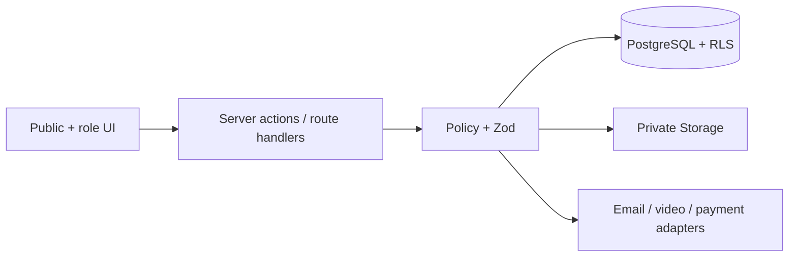

# Целевая LMS-архитектура «Пятёрки»

Версия 1.0 · 1 августа 2026

## Архитектурный принцип

Сохраняется текущий модульный монолит: Next.js App Router, Server Components/Actions, Supabase Auth, PostgreSQL, RLS и private Storage. Новые функции добавляются вертикальными модулями, без микросервисов и дублирования источников истины.

## Доменная модель

- Identity: user, profile, role assignment.
- Scope: parent link, group membership, teacher assignment, curator assignment.
- Academic: academic year, exam type, subject, program, course, module, topic, lesson.
- Delivery: schedule event, meeting link, recording, material, attendance.
- Assessment: assignment, question, version, attempt, answer, review, score.
- Mock exam: mock, version, assignment, attempt, answer, result, score scale.
- Progress: completion event, topic mastery, subject snapshot, score forecast.
- Commerce: plan, feature, subject limit, subscription, payment, contract status.
- Communication: conversation, message, notification, curator report.

## Роли

Текущие `student`, `parent`, `teacher`, `curator`, `admin` сохраняются. В отдельной additive migration позднее добавляются `manager` и `technical_admin`:

- manager — заявки, договоры, ручные оплаты и клиентский сервис без доступа к учебным ответам;
- technical_admin — integrations, feature flags, audit и role grants без доступа к содержимому личной переписки по умолчанию.

## Матрица разрешений

Обозначения: `R` — просмотр, `W` — изменение, `S` — scoped область, `—` — нет доступа.

| Действие | Ученик | Родитель | Преподаватель | Куратор | Менеджер | Админ | Тех. админ |
|---|---|---|---|---|---|---|---|
| Профиль ученика | RW свой | R подтверждённых | R-S свои группы | R-S закреплённых | R-S клиентский минимум | RW | R технический минимум |
| Редактировать профиль | W свой некритичный | — | — | — | W контактный минимум | W | — |
| Предметы | R свои | R детей | R-S | R-S | R статус | RW | — |
| Назначить курс | — | — | — | рекомендация | — | W | — |
| Создать/редактировать урок | — | — | W-S | — | — | W | — |
| Создать задание | — | — | W-S | — | — | W | — |
| Проверить задание | — | — | W-S | R-S | — | W | — |
| Оценки | R свои | R детей | RW-S | R-S | — | RW | — |
| Создать занятие | — | — | W-S по политике | — | — | W | — |
| Перенести/отменить | — | — | W-S по политике | — | — | W | — |
| Посещаемость | R свою | R детей | W-S | R-S | — | RW | — |
| Аналитика | R свою | R детей | R-S групп | R-S учеников | агрегаты | R | агрегаты |
| Оплаты | R свои | R детей по связи | — | — | RW | RW | R аудит |
| Тарифы | R | R | R | R | R | RW | — |
| Родительские отчёты | R если опубликован | R | комментарий | RW-S | — | RW | — |
| Пользователи/роли | — | — | — | — | R минимум | RW | W grants с аудитом |

UI никогда не является единственной защитой. Каждая строка обеспечивается RLS или security-definer RPC с проверкой роли и области.

## Пользовательские сценарии

### Ученик

Регистрация → онбординг → pending subscription → активация администратором → группа → “Сегодня” → занятие/материал → попытка ДЗ → обратная связь → пробник → прозрачный прогресс.

### Родитель

Безопасное приглашение → подтверждение связи → выбор ребёнка → расписание/дедлайны/результаты → отчёт куратора → статус подписки. Переписка ученика не наследуется.

### Преподаватель

Свои группы → ближайшие занятия → подготовка урока → ссылка → attendance → публикация записи → выдача задания → очередь проверки → group insight.

### Куратор

Фактические сигналы риска → карточка закреплённого ученика → задача/сообщение → отчёт. Никаких психологических диагнозов.

## Учебная структура

`academic_period → program(exam_type, subject, grade) → course_run → module → topic → lesson`.

Текущие `programs/modules/topics/lessons` расширяются, а не дублируются. Нужны поля publication/status/version, связь lesson-module/topic и отдельная `course_runs` только когда появится несколько параллельных учебных лет.

## Урок

Урок — педагогический объект. Событие расписания — его конкретное проведение. Один урок может иметь переносы и повторное проведение без копирования материалов.

- lesson: title, goals, status, subject, topic, author;
- schedule_event: actual starts/ends UTC, school timezone, status;
- meeting_link: provider, join URL, secret server-only;
- recording: processing/published, storage/external source;
- material links: ordered attachments;
- attendance: one row per event/student.

## Задания

`assignment → assignment_version → questions → assignment_release → attempt → answers → review`.

Версия фиксируется при первой попытке. Автоматическая проверка работает только для детерминированных типов. Проверенные score и rubric изменяются только teacher/admin RPC; каждое изменение аудируется.

## Пробники

Пробник отделён от обычного задания из-за таймера, версии варианта, шкалы перевода и результата. `mock_exam_attempt` неизменяем после завершения; ответы автосохраняются, финализация транзакционна. Планировщик двух пробников в месяц появится после задания академического календаря и активных подписок.

## Расписание

Время хранится UTC, дополнительно сохраняется IANA timezone школы/создателя. Предлагаемая простая модель:

- `schedule_series`: правило группы, local start, duration, weekday, timezone, active range;
- `schedule_events`: материализованные конкретные занятия UTC;
- `schedule_event_changes`: перенос, отмена, замена преподавателя, reason;
- `teacher_availability`: недельные интервалы;
- `teacher_availability_exceptions`: отпуск/разовая доступность.

Конфликт проверяется exclusion constraint или transactional function. Ученик видит local time в своей timezone. Внешний календарь — поздний adapter.

## Посещаемость

Статусы: expected, present, late, absent, excused. Только преподаватель своей группы или admin изменяет. Куратор читает закреплённых, родитель — подтверждённых детей.

## Прогресс и аналитика

Источник истины — `learning_events` и immutable attempts. Агрегаты пересчитываются в snapshots. Прогноз балла — версия формулы и её входы, а не “ИИ”. До появления достаточных данных UI показывает empty state.

## Уведомления

`notifications` хранит in-app сообщение. `notification_deliveries` позже фиксирует канал/status/attempt. Создание идёт в той же транзакции с бизнес-событием; отправка email может выполняться безопасным cron-процессом. Для MVP достаточно in-app + adapter.

## Родительские отчёты

Отчёт имеет период, факты, рекомендации, статусы draft/published и отдельных recipients. Комментарий ученику и комментарий родителю разделены.

## Таблицы: расширить и добавить

### Расширить существующие

- `roles`: добавить manager/technical_admin позднее;
- `programs`: exam_type/grade/academic_period/publish fields;
- `lessons`: topic/module, goals, actual content status;
- `schedule_events`: teacher, change reason, source series;
- `assignments`: due/release/max score/version policy;
- `lesson_attendance`: late minutes, marked_by;
- `subscriptions`: contract/payment metadata без изменения цены клиентом.

### Добавлять по этапам

`academic_periods`, `course_runs`, `schedule_series`, `schedule_event_changes`, `teacher_availability`, `materials`, `lesson_materials`, `assignment_versions`, `assignment_questions`, `assignment_attempts`, `assignment_answers`, `assignment_reviews`, `mock_exam_versions`, `mock_exam_attempts`, `mock_exam_answers`, `notification_deliveries`, `curator_reports`, `report_recipients`.

## Индексы и ограничения

- partial indexes по active/status и upcoming starts_at;
- unique membership на активную группу;
- unique published recording per lesson/version;
- unique open attempt per assignment/student при соответствующей политике;
- check `ends_at > starts_at`, score ranges и timezone validation;
- exclusion constraint для пересечения materialized teacher events;
- FK delete restrict для результатов/оплат/аудита, cascade только для чистых join-таблиц.

## RLS-подход

Создать узкие helper functions `teaches_group(group_id)`, `curates_student(student_id)`, `parent_of(student_id)`, `student_in_group(group_id)`. Не использовать `has_role('teacher')` как достаточное условие для чтения всех учеников. Коммерческие и проверенные данные изменяются только RPC. Тесты должны запускаться под JWT каждой роли.

## Storage

Buckets остаются приватными: lesson-materials, lesson-recordings, student-submissions. Путь включает tenant/domain owner id, но доступ определяется не строковым prefix, а серверной проверкой связи с lesson/submission. Signed URL короткоживущий. MIME, size и checksum валидируются до публикации.

## Маршруты

- Public: `/`, `/ege`, `/oge`, `/subjects`, `/plans`, `/about`, `/legal/*`.
- Student: `/student`, `/student/schedule`, `/student/subjects`, `/student/lessons`, `/student/assignments`, `/student/mocks`, `/student/progress`.
- Parent: `/parent`, `/parent/children/[id]/*`.
- Teacher: `/teacher`, `/teacher/groups/[id]`, `/teacher/lessons/*`, `/teacher/reviews`.
- Curator: `/curator`, `/curator/students/[id]`, `/curator/reports`.
- Admin: справочники, группы, расписание, контент, коммерция, аудит.

## Server actions / use cases

Границы: `academics`, `schedule`, `lessons`, `assignments`, `mocks`, `progress`, `communications`, `commerce`. Action: auth → Zod → policy → transaction/RPC → revalidate. Провайдеры видео, email и оплаты скрыты за интерфейсом.

## MVP и этапы

Ближайший этап — дизайн-система и public site. Затем student agenda/lessons/materials, assignments, mocks, parent, staff и admin. FullCalendar/ECharts не добавляются до появления соответствующих реальных данных.

